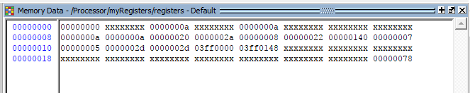

Thomas Sowders

MIPS Processor - Final Project

## Problem Statement

This project requires integrating the components of the MIPS datapath to build a functional processor. This involves developing support for the syscalls, building branch control logic, and connecting the datapath modules.

This processor only supports a subset of the full MIPS instruction set. The supported instructions are: add, addi, beq, bne, div, j, jal, jr, lui, lw, mfhi, mflo, mult, or, ori, sub, sw, and syscall. The supported system services correspond to services 1, 4, 5, and 10: Display an integer, display a string, read a user input as an integer, and end the simulation.

## Approach

The processor is constructed of behaviorally-modelled Verilog modules. This design is intended for simulation only; it is not suitable for synthesis without extensive modification. 

I used ModelSim to analyze the components of the processor while testing the integration process. Icarus can also simulate the processor, but has much less interactivity.

I developed a drawing of the datapath that mapped out the inter-module connections and control signals. I used this to create a spreadsheet of the state of each control element during the execution of each operation. That file is included (Control Signals.xls).

The MIPS binary file provided with the assignment includes many assembled instructions that are not supported by the model processor. To run the Fibonacci program, I removed the unneeded instruction (add.d $f2, $f4, $f6) and converted others to equivalent operations that are supported (for example, li $t1 1 became addi $t1, $0, 1). The modified, unassembled code is included with the project submission (fibs.asm). I assembled it using MARS, then modified the binary encoding of each la pseudoinstruction. This is necessary because the model processor, unlike MARS, has overlapping instruction and data memory address spaces, both beginning at 00000000. 

Because Verilog, as a hardware description language, is not designed for real-time user interaction, it lacks a convenient way to accept user input at runtime. For this model, the user can input an integer, which accessed by syscall 5. This input is read from the file input.txt, and the input is expected as an eight-character hexadeximal value.

## Results

A screenshot of the successful execution of the modified binary file is below.

To test every opcode supported by the processor, I wrote a program that uses each operation. The unassembled text of that program is included (testprogram.asm), as well as the assembled text (MIPSinst-count.txt) and the data segment (MIPSdata-count.txt). The program manipulates values in registers to test the R-type instructions, then reads from the user input file (input.txt), prints integers in increasing order to up to the input value, then terminates the simulation. This test exercises each of the syscall functions and the branching instructions. To run this program, rename the two files by removing the "-count" suffix. 

Below is a screenshot of the simulation output of this program. The user input for this run is 10.

After running the program, the processor’s register values are as displayed by the simulator:

Each register value matches the value of the corresponding register when the same program is executed in MARS.

The following pages include the waveform trace of each net in the top-level module as it executes the test program.

